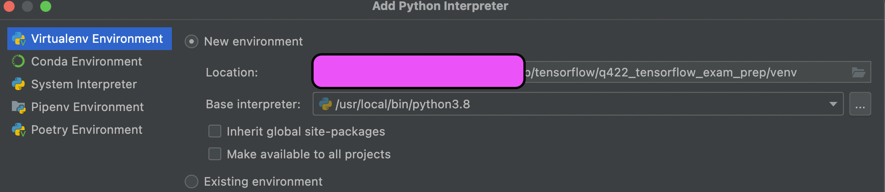
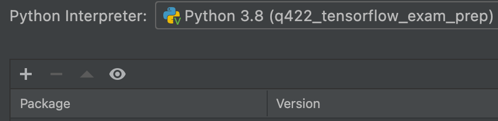
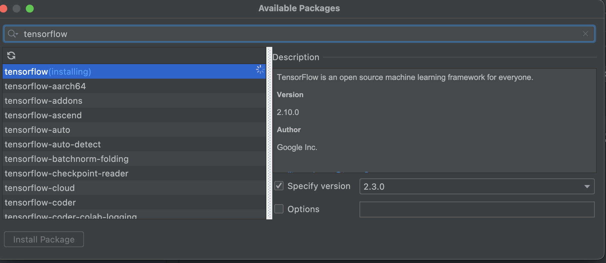

# q422_tensorflow_exam_prep
tensorflow certificate exam preparation

## pycharm env setting up (note: if you are using Mac M1 chip, ignore this whole pycharm setup and use colab instead)
### step 1: python 3.8
- install from https://www.python.org/downloads/macos/
- in terminal, make sure return 3.8
  - $ python3 --version
### step 2: Create file `requirements.txt` under root folder
### step 3: setup python interpreter in PyCharm
- Preferences -> Python Interpreter -> click on "Python Interpreter"
-> Show all -> click '+' to new one


- in PyCharm Terminal: 
```
$ pip freeze | xargs pip uninstall -y
$ pip3 install -r requirements.txt
```
to install all packages at once

- (not need, only when you want to install package manually one by one) 
Preferences -> Python Interpreter -> click on '+' 
-> search for tensorflow -> specify version 2.3.0
-> Install Package




